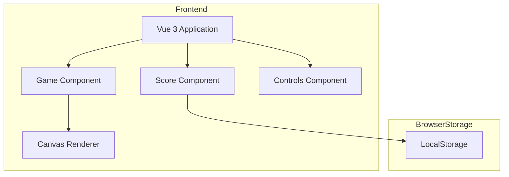

## 1. Architecture Design

## 2. Technology Description
- Frontend: Vue@3 + TypeScript + tailwindcss@3 + vite
- Initialization Tool: vite-init
- Backend: None (client-side only)
- Data Storage: LocalStorage for high score persistence

## 3. Route Definitions
| Route | Purpose |
|-------|---------|
| / | Game page with all game functionality |

## 4. API Definitions
No backend APIs needed for this client-side game.

## 5. Server Architecture Diagram
Not applicable for this client-side only application.

## 6. Data Model
### 6.1 Data Model Definition
Simple score persistence using LocalStorage.

### 6.2 Data Definition Language
No database needed. High score stored as JSON in LocalStorage.
