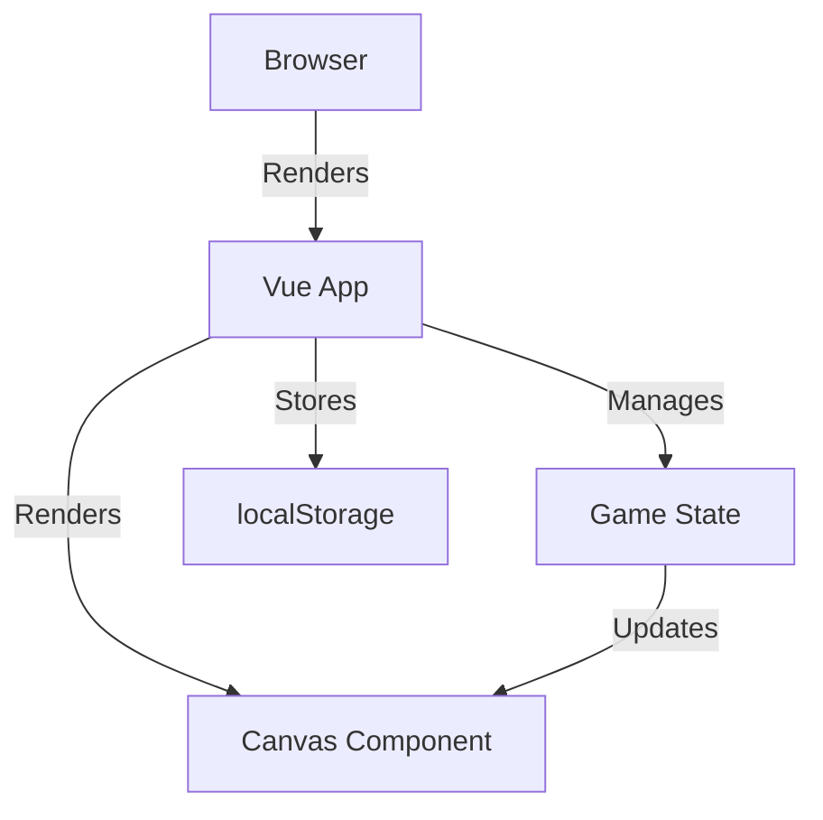
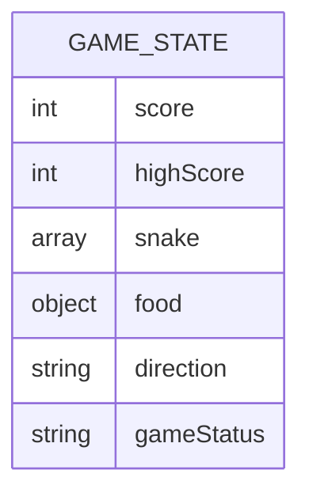

## 1. Architecture Design
Single-page Vue.js application with Canvas rendering for the game board.

## 2. Technology Description
- Frontend: Vue@3 + TypeScript + tailwindcss@3 + vite
- Initialization Tool: vite-init
- Backend: None
- Database: localStorage for high score persistence

## 3. Route Definitions
| Route | Purpose |
|-------|---------|
| / | Main game page |

## 4. API Definitions (if backend exists)
Not applicable - no backend.

## 5. Server Architecture Diagram (if backend exists)
Not applicable - no backend.

## 6. Data Model (if applicable)
### 6.1 Data Model Definition

### 6.2 Data Definition Language
No database - uses localStorage to store high score as JSON.
