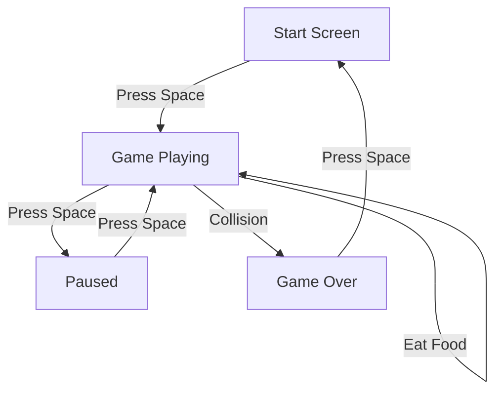

## 1. Product Overview
A modern, interactive Snake game built with Vue.js and Tailwind CSS. Features include score tracking, high score persistence, and smooth animations.
- Classic arcade gameplay with modern aesthetics
- Responsive design for all screen sizes

## 2. Core Features

### 2.1 User Roles (if applicable)
Not applicable - single player game

### 2.2 Feature Module
1. **Game Canvas**: Interactive grid for snake movement and food
2. **Score Display**: Current score and high score tracking
3. **Controls**: Keyboard arrow keys for direction
4. **Game States**: Start, playing, paused, game over

### 2.3 Page Details
| Page Name | Module Name | Feature description |
|-----------|-------------|---------------------|
| Game Page | Game Canvas | 40x40 grid canvas for snake gameplay |
| Game Page | Score System | Tracks current score and saves high score to localStorage |
| Game Page | Controls | Arrow keys to change direction, space to pause/resume |
| Game Page | Game States | Start screen, game play, pause overlay, game over screen |

## 3. Core Process
1. User loads the page and sees start screen
2. User presses space to start game
3. Snake moves automatically in current direction
4. User uses arrow keys to change direction
5. Snake eats food to grow and increase score
6. Game ends when snake hits wall or itself
7. High score is saved

## 4. User Interface Design
### 4.1 Design Style
- **Colors**: Dark theme with teal accents (#10b981), black background (#0f172a), and light text (#f8fafc)
- **Button style**: Rounded, pill-shaped buttons with hover effects
- **Font**: JetBrains Mono for retro gaming feel
- **Layout style**: Centered container with canvas as focal point
- **Icon style**: Simple geometric shapes

### 4.2 Page Design Overview
| Page Name | Module Name | UI Elements |
|-----------|-------------|-------------|
| Game Page | Start Screen | Large title, instructions, start button with pulse animation |
| Game Page | Game Canvas | Dark grid with teal snake and orange food |
| Game Page | Score Display | Fixed top-right corner with animated score updates |
| Game Page | Game Over | Red overlay with restart button |

### 4.3 Responsiveness
Desktop-first with mobile responsiveness, touch controls for mobile devices.
