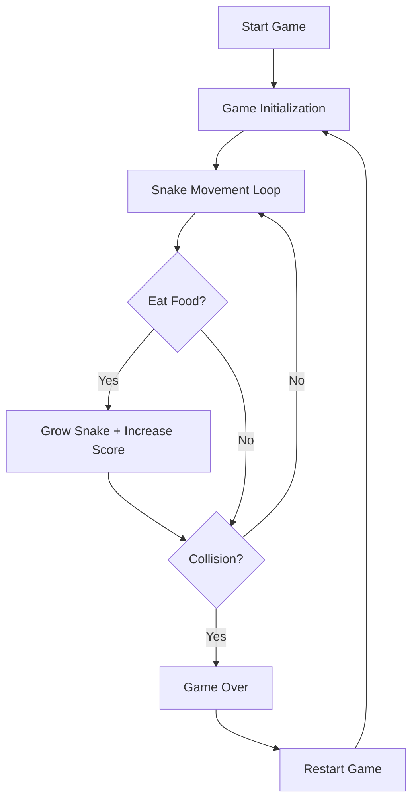

## 1. Product Overview
A modern, visually appealing Snake game built with Vue 3 and TypeScript, featuring smooth animations, responsive design, and intuitive controls.
- Classic Snake gameplay with modern aesthetics, suitable for casual gaming on desktop and mobile devices
- Provides an engaging user experience with score tracking, high score persistence, and clean UI

## 2. Core Features

### 2.2 Feature Module
1. **Game Page**: Canvas game board, score display, controls, game state management

### 2.3 Page Details
| Page Name | Module Name | Feature description |
|-----------|-------------|---------------------|
| Game Page | Game Board | Interactive canvas for snake movement and food consumption |
| Game Page | Score Display | Real-time current score and high score tracking |
| Game Page | Controls | Keyboard arrow keys and on-screen buttons for mobile |
| Game Page | Game States | Start, playing, pause, and game over states |

## 3. Core Process
User opens the game → Clicks start button → Snake moves automatically → User controls direction → Snake eats food to grow and score points → Game ends when snake hits wall or itself → User can restart game

## 4. User Interface Design
### 4.1 Design Style
- **Primary Color**: Dark teal (#0d9488) for snake and accents
- **Secondary Color**: Soft orange (#f97316) for food
- **Background**: Deep dark gray (#0f172a) with subtle grid pattern
- **Button Style**: Rounded corners with gradient backgrounds, hover animations
- **Font**: Modern sans-serif (Poppins) with clear hierarchy
- **Layout Style**: Centered card-based design with clean spacing
- **Icon Style**: Minimal SVG icons with smooth transitions

### 4.2 Page Design Overview
| Page Name | Module Name | UI Elements |
|-----------|-------------|-------------|
| Game Page | Header | Game title with gradient text, decorative elements |
| Game Page | Game Board | Canvas with grid background, snake with gradient colors, pulsing food |
| Game Page | Score Panel | Current score and high score with animated counters |
| Game Page | Controls | On-screen direction buttons for mobile, keyboard hints |
| Game Page | Game States | Overlay screens for start, pause, and game over with smooth transitions |

### 4.3 Responsiveness
Desktop-first design with mobile-adaptive layout, touch-optimized controls, and responsive canvas sizing.

### 4.4 3D Scene Guidance
Not applicable for this 2D game.
